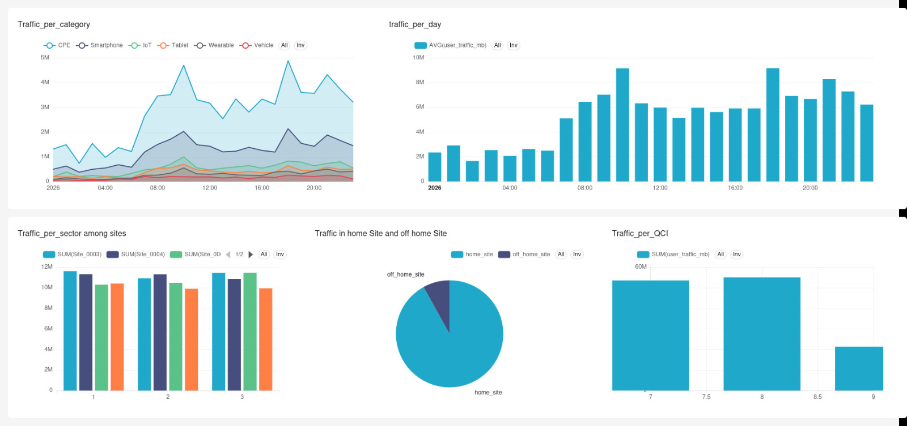

# Telecom Session Lens

An interactive analytics dashboard for exploring telecom data sessions built with Apache Superset.

## Overview

This project analyzes telecom session-level data to answer key questions about network traffic patterns, device usage, geographic load distribution, and user behavior. All insights are visualized through an interactive Apache Superset dashboard.

## Key Questions & Findings

### Q1 – When does the network experience peak traffic?

**Findings:** The network experiences two major traffic surges during the day:
- Morning peak: **10:00 AM** (over 9 million MB)
- Evening peak: **6:00 PM** (nearly identical magnitude)

### Q2 – Which device categories consume the most data?

**Findings:** Stationary equipment dominates network bandwidth:
- **CPE** (Customer Premises Equipment): ~4 million MB (evening peak)
- **Smartphones**: ~1.75 million MB
- Tablets, IoT, wearables, and vehicles show minimal traffic

### Q3 – Which sites and sectors carry the most traffic?

**Findings:** Traffic is concentrated in specific sectors:
- **Site_0003** and **Site_0004** carry the most traffic
- **Sector 3** shows a massive surge from **Site_0001** (busiest individual sector configuration)

### Q4 – How does data usage differ among user percentiles?

**Findings:** A small percentage of power users drive disproportionate traffic:
- Top 10% and 20% users show exponentially higher daily baselines (~9-10 on log scale)
- Bottom 20% users have tightly clustered, low baselines (~6.5 on log scale)

### Q5 – How do user mobility and QCI impact traffic?

**Findings:** The network functions primarily as fixed broadband replacement:
- **At Home**: ~120 million MB (vast majority of load)
- **Off Home**: ~10 million MB (minimal by comparison)
- **QCI 8 and 7** (non-GBR default bearers): both >50 million MB (dominant)

## Apache Superset Setup

you have multiple ways to deploy superset i have tried it on linux and windows and found it pretty hard using docker compose alot of error so i tried using pip and it was pretty easy 

here is the link for the installion using pypi 

https://superset.apache.org/admin-docs/installation/pypi

it is advisable when generating the secret key is to store it in linux for example you can store it in ~/home/superset/super_set_config.py file and 
source it each time you open the app this might save you alot of headache 
with LLMs

follow and it will work fine 

here is the dashboard after finsihing 



## Project Structure

```
Telecom_session_lens/
├── assets/                # Dashboard screenshots & images
├── data/                  # Processed session data
├── docker/                # Docker configuration for Superset
├── Telecom_EDA.ipynb      # Exploratory Data Analysis notebook
└── README.md
```